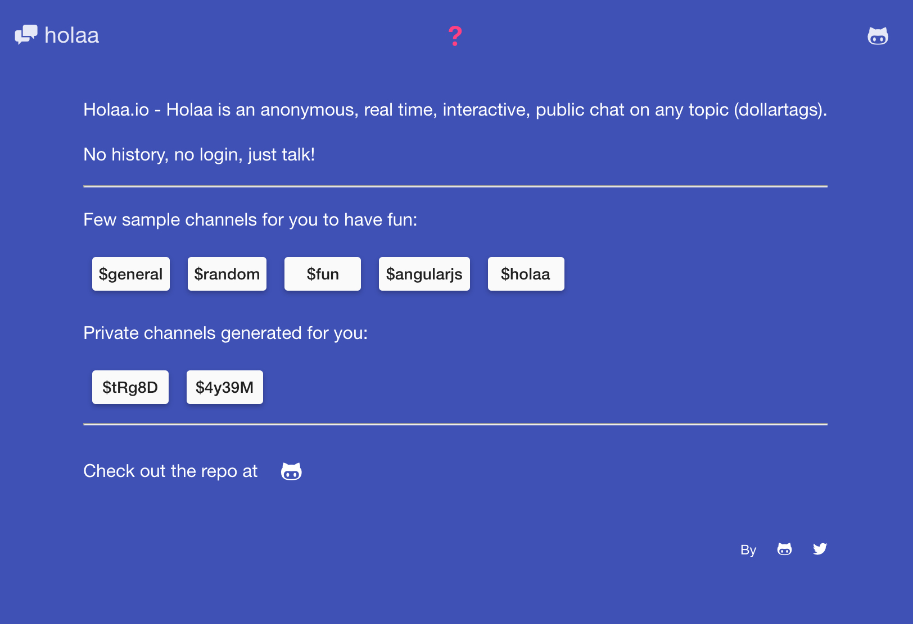

# Holaa.io
Live interactions / conversations around public dollartags. No history, no login, just talk on any topic.
Holaa.io is an anonymous public chat on any topic (dollartags) - No history, no login, just choose a topic and talk.

Built with MEAN Stack, Angular-Material UI & sockets

Enter Holaa: [http://holaa.io/about](http://holaa.io/about)

Try some of these $channels, enter your name and you're ready to chat:
* [http://holaa.io/$general](http://holaa.io/$general)
* [http://holaa.io/$random](http://holaa.io/$random)
* [http://holaa.io/$fun](http://holaa.io/$fun)
* [http://holaa.io/$holaa](http://holaa.io/$holaa)
* [http://holaa.io/$theunexpected1](http://holaa.io/$theunexpected1)

## Technology
* Front end (client) is built using:
  * [AngularJs](http://angularjs.org/)
  * [Angular Material](https://material.angularjs.org)
  * [Sockets](http://socket.io/)
* Back end (server) is built using:
  * [NodeJs](https://nodejs.org)
  * [ExpressJs](http://expressjs.com/)
  * [Sockets](http://socket.io/)
  
## Installation & setup
* clone the repository with `git clone https://github.com/theunexpected1/holaa.io.git`
* run `sudo npm i` to install node packages
* run `bower i` to install bower packages
* run `npm start` to run the app on port '8080'
* Navigate to `http://localhost:8080` in your browser

#### Building
Build files are included in the repo, but for development refer below:
* run `grunt` to build SASS/JS files

#### Issues
Reporting issues in terms of bugs, functionality suggestions, UX, or improvements is more than welcome.

#### Contributing
Feel free to fork this repo and submit a pull request to address existing issues, or submit new functionality.